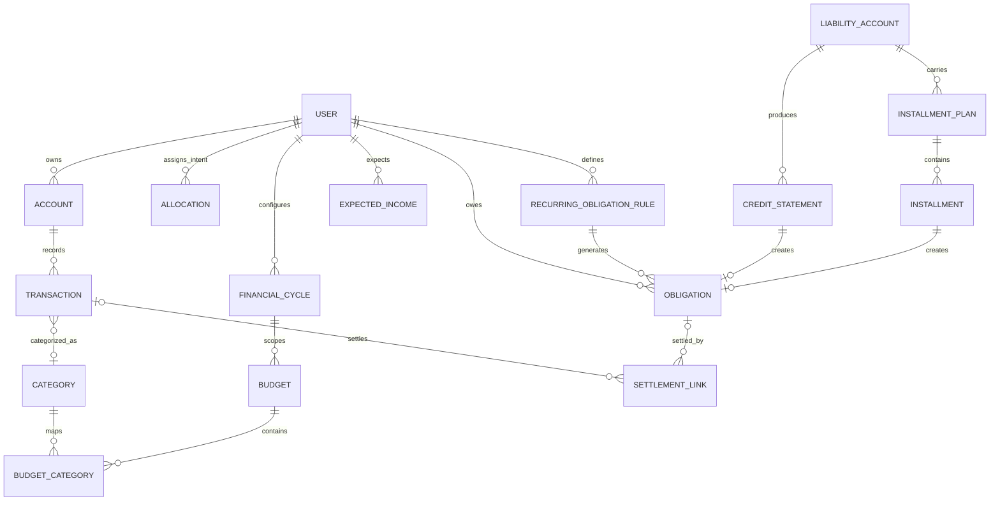

# V1 Domain Model

**Document ID:** DM-V1  
**Status:** APPROVED / FROZEN — Normative Conceptual Model

## 1. Principles

- `DM-PRINCIPLE-001` One economic event MUST affect aggregate financial state exactly once.
- `DM-PRINCIPLE-002` Actual and Forecast are separate states; forecast records never masquerade as realized transactions.
- `DM-PRINCIPLE-003` Allocation classifies owned money; it does not create money.
- `DM-PRINCIPLE-004` Budget is a spending plan; it is not a money allocation.
- `DM-PRINCIPLE-005` Credit capacity is liability capacity, not liquidity.
- `DM-PRINCIPLE-006` Derived values are recomputable, not independently editable.
- `DM-PRINCIPLE-007` This is a conceptual model, not a mandated physical database schema.

## 2. Aggregate Overview



## 3. Account — `DM-ACCOUNT-001`

Fields: `account_id`, `name`, `account_class ASSET|LIABILITY`, generic `account_type`, `currency`, `status ACTIVE|ARCHIVED`, `liquidity_eligible`, opening state, timestamps.

Invariants:
- liability credit limit contributes zero Available Money;
- archive preserves history/economic effect;
- provider names are configuration/data, not engine logic.

## 4. Transaction — `DM-TRANSACTION-001`

A realized economic event.

Kinds:

```text
INCOME
EXPENSE
TRANSFER
LIABILITY_PURCHASE
LIABILITY_PAYMENT
REFUND
BALANCE_ADJUSTMENT
FEE_INTEREST
```

Required semantics: immutable ID, amount `>0`, effective time, currency, status `POSTED|VOIDED`, affected account leg(s), optional category, provenance.

Invariants:
- transfers between owned accounts are not income/expense;
- liability purchase recognizes spending and liability at purchase time;
- liability payment reduces asset + liability without duplicate expense;
- void/edit propagates to all dependent derived values.

## 5. Category — `DM-CATEGORY-001`

A user/system-defined spending purpose used to classify Expense/Fee transactions and map them to Budgets. V1 MUST NOT hardcode the founder's category list as the only supported taxonomy.

## 6. Allocation — `DM-ALLOCATION-001`

Types: `FLEXIBLE | RESERVED | LOCKED`. `UNALLOCATED` is derived.

Fields: ID, type, amount, purpose, status, optional linked obligation, optional source account constraint.

```text
Flexible + Reserved + Locked + Unallocated = Available Money
```

Budget is explicitly **not** an Allocation type. Newly available money does not create an Allocation record; with explicit allocations unchanged, it increases derived Unallocated. Only explicit allocation commands move money among intent roles.

## 7. Financial Cycle — `DM-CYCLE-001`

Configuration/domain instance describing cycle boundaries.

Fields/semantics:
- `anchor_day` 1..31;
- `adjustment_policy NONE|PREVIOUS_WORKING_DAY|NEXT_WORKING_DAY`;
- Financial Timezone;
- derived start/next-start/end dates.

Financial Calendar is the sole boundary authority. An anchor or adjustment-policy change never rewrites the active cycle. Its post-active-cycle transition is an Extended Cycle when shorter than 15 days (merged with the following regular cycle), or a standalone Short Cycle when at least 15 days.

V1 working-day adjustment uses weekdays only; no holiday-calendar entity is required.

## 8. Budget — `DM-BUDGET-001`

A cycle-scoped spending plan.

Fields:
- `budget_id`;
- `financial_cycle_id`;
- `name/purpose`;
- `budget_amount >= 0`;
- status `ACTIVE|CLOSED|CANCELLED`;
- one or more category mappings;
- creation/template provenance.

Derived: `spent`, `remaining`, `overspend`, `utilization`, pace state, projected spending/overspend.

Invariants:
- each Budget belongs to exactly one Financial Cycle;
- Spent derives only from actual eligible expenses;
- budget consumption does not move money;
- new-cycle template creates new Budget IDs and Spent=0;
- old budgets remain historical;
- Budget creation/amount changes do not reserve or move money;
- aggregate Budget amount is not constrained by Flexible Money; an excess is a derived warning state, not invalid financial state.

## 9. Obligation — `DM-OBLIGATION-001`

A known required outflow.

Fields: ID, source type, source ID, amount due, amount settled, due time, status, optional linked reservation.

Sources include `MANUAL|CREDIT_STATEMENT|BNPL|INSTALLMENT|RECURRING_RULE`.

`remaining_due=max(0, amount_due-amount_settled)`. Overdue unpaid obligations remain active.

## 10. Recurring Obligation Rule — `DM-REC-OBL-001`

Defines predictable obligation generation.

Fields: ID, recurrence pattern, start/end, due-day/timing semantics, status, one or more non-overlapping `AMOUNT_STAGE` records with `effective_from`, optional `effective_to`, and amount.

Exactly one amount stage must resolve for each generated occurrence. This supports staged KPR/subscription/payment amounts without assuming constant amount forever.

## 11. Expected Income — `DM-EXPECTED-INCOME-001`

A future inflow assumption owned by Income Management, never actual money before an explicitly linked actual receipt.

Fields: ID, expected amount/date, recurrence/source, `certainty EXPECTED_STABLE|EXPECTED_UNCERTAIN`, status `EXPECTED|RECEIVED|MISSED|CANCELLED`, optional actual Income transaction link. `EXPECTED_STABLE` has deterministic Base Forecast inclusion; `EXPECTED_UNCERTAIN` is Scenario-only unless explicitly selected.

Invariants:
- contributes zero to Account Balance, Available, Flexible, STS, and Daily STS before an explicitly linked actual receipt;
- may participate in Forecast/scenarios;
- `EXPECTED→RECEIVED` requires the user's explicit link to an actual INCOME transaction owned by Financial Accounts & Ledger and retires the future duplicate effect; the resulting newly available money remains Unallocated until explicit allocation;
- actual Income may remain unlinked; amount/date/description/source similarity cannot mark Expected Income `RECEIVED`;
- if expected time passes without linked receipt, status becomes `MISSED`; a late explicit link may transition `MISSED→RECEIVED`;
- no V1 probability/confidence score.

## 12. Credit Statement — `DM-CREDIT-STMT-001`

Statement-period representation for revolving liability: account, period, cutoff, due date, amount due, status, linked obligation. Purchase expense remains recognized at purchase time; statement is repayment planning, not a second expense.

## 13. Installment Plan / Installment — `DM-INSTALLMENT-001`

Plan fields include source liability/purchase, principal, known total fees/interest where applicable, status. Each Installment has due date and **actual required installment amount** and normally creates one obligation. The model MUST NOT derive installment amount solely as principal/count unless that is explicitly the contractual schedule.

## 14. Settlement Link — `DM-SETTLEMENT-001`

Links a posted payment transaction to an Obligation and settlement amount. Total valid settlements cannot exceed obligation amount due.

## 15. Forecast Projection — `DM-FORECAST-001`

Forecast is a derived projection, not a canonical money container. A projection consists of:
- actual starting snapshot;
- included future events;
- assumption/scenario set;
- projected positions over time;
- engine/rule version.

Forecast values MUST NOT be written back as actual balances. Derived forecast states include Base Forecast, selected Scenario Forecasts, projected funding deficit/risk, and Funding Dependency. Funding Dependency is not a canonical money container and does not alter STS.

## 16. Advisor Insight — `DM-INSIGHT-001`

A derived explanatory object containing insight type, referenced engine metrics, explanation sections, and optional deterministic corrective amount. It has no authority to mutate financial state.

## 17. Core Separation

```text
ACCOUNT + TRANSACTION              = actual financial reality
ALLOCATION                         = role of actual owned money
BUDGET                             = planned spending limit for a cycle
OBLIGATION                         = required outflow
EXPECTED_INCOME                    = future assumption
FORECAST                           = projected future state
STS / DAILY STS                    = current safety guidance
ADVISOR INSIGHT                    = deterministic interpretation
```
